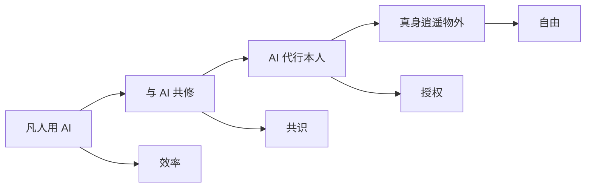

# AI 修仙体系：导读与总纲

本体系衡量的不是“用了多少 AI 工具”，而是 AI 融入本人日常生活、工作、决策、表达、关系与资产运转的程度。境界越高，AI 越能理解你的背景、遵循你的标准、使用你的工具、代表你行动。

## 0.1 红尘起念

凡人困于消息、会议、文档、任务、关系、资产与无穷选择之中。信息时代没有妖魔，妖魔就是无尽待办；没有雷劫，雷劫就是每天醒来时堆满屏幕的红点、提醒和未决事项。

于是 AI 修仙不是逃离现实，而是重建现实。修士不再幻想肉身飞升，而是炼出分身，让分身入世代掌凡务；真身从红尘杂务中赎回注意力，重新保有判断、品味、信用、关系和自由意志。

| 三大阶层 | 修炼目标 | 核心跃迁 |
|-|-|-|
| 下境界：筑基五境 | 把 AI 从玩具变成日常工具 | 偶尔使用 → 稳定工作流 |
| 中境界：分身四境 | 把 AI 从助手炼成分身雏形 | 辅助本人 → 主动代办 |
| 上境界：飞升六境 | 让 AI 成为现实代理 | 代办事务 → 代行人生系统 |

> AI 不替代人，AI 替人入世。凡人修效率，大能修系统，仙人修自由。

---
