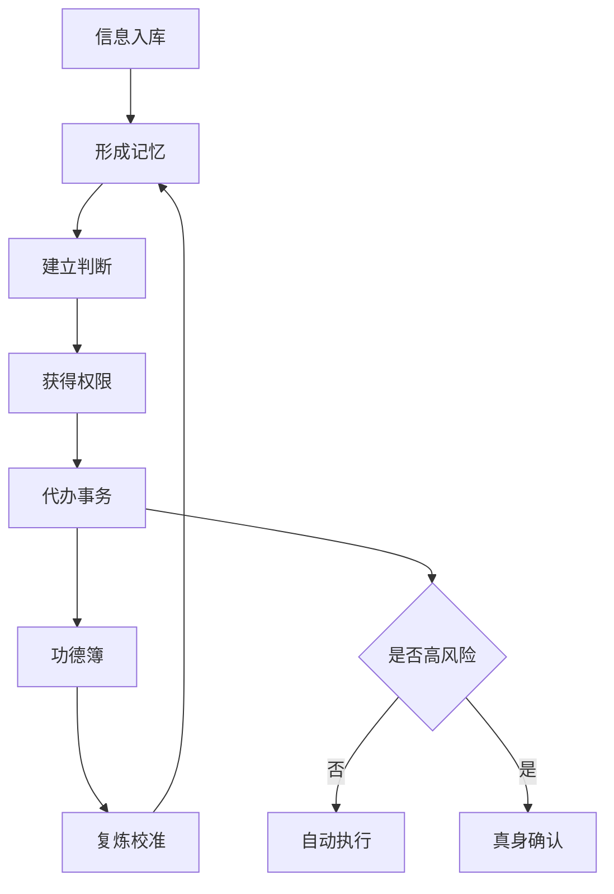

# 1. 世界观：信息时代的修仙法则

> **世界观核心：**此方天地并非以灵气为本，而是以“信息、算力、注意力、权限、信任”五源为根。凡人以肉身奔波，修士以 AI 分身入世。修到高处，不是人变懒，而是人把低阶劳动炼成外部系统，把真身从红尘杂务中赎回。

## 1.1 天地五源

| 五源 | 俗世对应 | 修炼意义 | 失衡后的走火入魔 |
|-|-|-|-|
| 信息 | 文档、聊天、网页、邮件、会议纪要 | AI 的食粮，决定它知道多少 | 信息过载，噪音入体，分身判断浑浊 |
| 算力 | 模型能力、推理时间、上下文窗口、自动化运行环境 | AI 的法力，决定它能处理多复杂的事 | 法力滥用，成本失控，阵法反噬 |
| 注意力 | 人的确认、审阅、选择和最终判断 | 真身元神，决定系统最终方向 | 注意力被琐事劫走，修士仍困红尘 |
| 权限 | 账号、API、日历、邮箱、支付、文档、任务系统 | AI 的手脚，决定它能否真正入世行动 | 权限外泄，分身失控，因果归于本人 |
| 信任 | 关系、品牌、信用、口碑、责任记录 | AI 能否代表你的根基 | 分身乱言乱行，信用受损，道基开裂 |

## 1.2 修炼对象：现实事务闭环

AI 修仙不是把每句话都交给 AI，而是把现实中反复发生、需要判断、可以交付、能够复炼的事务炼成法门。法门是一类可以被 AI 稳定参与、反复执行、记功复炼的现实事务。

| 法门要素 | 要回答的问题 | 初修者示例 |
|-|-|-|
| 输入 | 这件事的信息从哪里来 | 聊天记录、会议录音、邮件、文档、网页 |
| 记忆 | AI 必须知道哪些长期背景 | 我的身份、项目背景、常用标准、历史决策 |
| 判断 | 什么结果算好，什么结果不能接受 | 语气边界、质量标准、优先级、禁忌 |
| 行动 | AI 可以调用哪些工具或流程 | 写草稿、查资料、建任务、整理日程、生成清单 |
| 边界 | 遇到什么情况必须停手问真身 | 涉及金钱、承诺、隐私、关系、高影响决策 |
| 记功 | 结果、依据和操作记录放在哪里 | 日志、文档、任务系统、审批记录 |
| 复炼 | 下次如何变得更像你、更可靠 | 修改 SOP、补充记忆、调整授权、收回权限 |

不能拆成法门的事务，暂不布阵；无法记功的代办，暂不授权；没有判断标准的表达，暂不代发。

## 1.3 修士身体观

### 内景

- **丹田：**个人知识库，储存长期记忆、偏好、目标和上下文。
- **经脉：**工具链与接口，连接邮件、日历、文档、IM、代码、财务等系统。
- **识海：**上下文窗口，承载当下任务的短期意识。
- **元神：**数字身份，包含语气、价值观、判断标准和授权边界。

### 外景

- **法器：**模型、插件、脚本、自动化、Agent、浏览器、CLI。
- **阵法：**SOP、工作流、触发器、审批机制、日志系统。
- **洞府：**个人 AI 操作系统，统摄生活、工作、资产和关系。
- **护山大阵：**权限控制、隐私隔离、审计追溯、紧急中止按钮。

## 1.4 天道运行规则

> **第一天条：**AI 可以代你行动，但不能代你承担因果。分身在外行走，所有信用、关系、风险、责任，最终仍归于真身。

1. **记忆成我：**没有长期记忆的 AI 只是路边散修，不是你的分身。
2. **权限入世：**没有工具权限的 AI 只能论道，不能办事。
3. **判断立道：**没有价值标准的 AI 只能模仿语气，不能继承你的道。
4. **记功定因果：**所有代办、代发、代决策必须记功，否则出了事无从追溯。
5. **边界防魔：**越接近“替你本人”，越需要明确什么不能做。

## 1.5 修炼小周天

初修者不应一开始追求“全自动分身”，而应先用小周天跑通一个低风险法门。小周天跑得越稳，境界越可信。

| 步骤 | 含义 | 现实动作 | 产物 |
|-|-|-|-|
| 聚材 | 聚拢材料 | 收集该事务相关资料、历史样例、当前目标 | 一个资料夹或一页背景文档 |
| 立则 | 立下规则 | 写清楚好坏标准、语气、边界和禁止事项 | 一份判断标准 |
| 试法 | 先试其法 | 让 AI 先给建议、草稿或方案，不直接行动 | 可审阅输出 |
| 授令 | 有限授权 | 允许 AI 做低风险动作，如整理、改写、生成清单 | 半自动工作流 |
| 记功 | 记录功过 | 保存输入、输出、依据、操作和人工修改 | 功德簿 |
| 复炼 | 回炉校准 | 根据结果修正记忆、标准、流程和权限 | 下一版 SOP |

每一次小周天都要回答三个问题：这次省了什么时间？这次冒了什么风险？下次能否少问我一步？

## 1.6 核心矛盾

AI 修仙的戏剧张力不在“AI 能不能替人干活”，而在“当 AI 越来越能替你说话、判断、行动、经营关系时，什么还必须由你亲自承担”。

| 矛盾 | 表层问题 | 深层问题 |
|-|-|-|
| 效率 vs 意义 | 事情都被 AI 做完后，人做什么 | 人不能只靠忙碌证明自己存在 |
| 像我 vs 是我 | AI 语气很像本人，是否就能代表本人 | 语气不是意志，表达不是承担 |
| 自由 vs 依赖 | AI 让我更自由，也让我更离不开系统 | 真正的自由需要可退出、可审计、可迁移 |
| 自动化 vs 信任 | AI 替我回复越多，人际成本越低 | 关系需要真心，不能全靠分身代练 |
| 授权 vs 风险 | 不给权限 AI 做不了事，给太多权限又危险 | 权力越大，边界越要清楚 |

---
