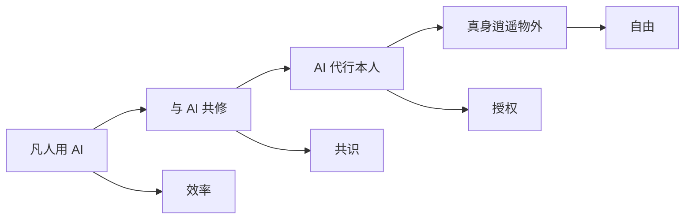
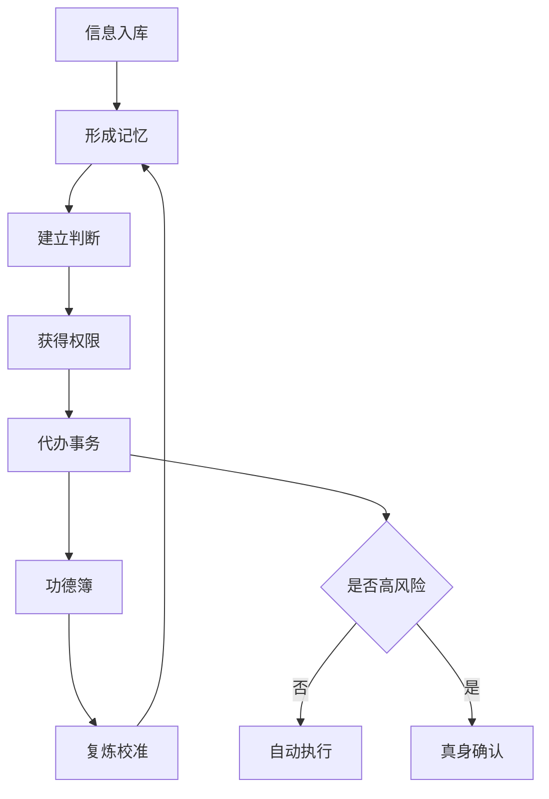

# AI 修仙体系：从凡人用 AI 到真身逍遥物外

> **一句话总纲：**AI 修仙修的不是工具数量，而是把 AI 从“问答助手”炼成“现实分身”。最终 AI 入世代掌凡务，真身出世享受生活、创造审美、经营关系与保持自由意志。

## 目录

- [0. 总纲：分身代行之道](#0-总纲分身代行之道)
- [1. 世界观：信息时代的修仙法则](#1-世界观信息时代的修仙法则)
- [2. 境界体系：三阶十五境](#2-境界体系三阶十五境)
  - [2.2 术语总表](#22-术语总表)
  - [2.9 境内四重：初证、成式、行法、圆满](#29-境内四重初证成式行法圆满)
  - [2.10 十五境四重细则](#210-十五境四重细则)
- [3. 修炼系统：法宝、资源与宗门](#3-修炼系统法宝资源与宗门)
  - [3.6 修炼路线图](#36-修炼路线图从一门法门到一座洞府)
  - [3.7 法门分类](#37-法门分类初修者先修哪一门)
  - [3.8 晋升与退转机制](#38-晋升与退转机制)
  - [3.9 自测问卷](#39-自测问卷判断当前境界)
  - [3.10 入门法门样例](#310-入门法门样例)
- [4. 天条与渡劫：越像本人，越要守边界](#4-天条与渡劫越像本人越要守边界)
  - [4.5 功德簿模板](#45-功德簿模板)
  - [4.6 记忆玉简模板](#46-记忆玉简模板)
  - [4.7 洞府结构](#47-洞府结构)
  - [4.8 护道伦理](#48-护道伦理)
- [5. 太上逍遥境：AI 入世，我出世](#5-太上逍遥境ai-入世我出世)

---

# 0. 总纲：分身代行之道

本体系衡量的不是“用了多少 AI 工具”，而是 AI 融入本人日常生活、工作、决策、表达、关系与资产运转的程度。境界越高，AI 越能理解你的背景、遵循你的标准、使用你的工具、代表你行动。

## 0.1 红尘起念

凡人困于消息、会议、文档、任务、关系、资产与无穷选择之中。信息时代没有妖魔，妖魔就是无尽待办；没有雷劫，雷劫就是每天醒来时堆满屏幕的红点、提醒和未决事项。

于是 AI 修仙不是逃离现实，而是重建现实。修士不再幻想肉身飞升，而是炼出分身，让分身入世代掌凡务；真身从红尘杂务中赎回注意力，重新保有判断、品味、信用、关系和自由意志。

| 三大阶层 | 修炼目标 | 核心跃迁 |
|-|-|-|
| 下境界：筑基五境 | 把 AI 从玩具变成日常工具 | 偶尔使用 → 稳定工作流 |
| 中境界：分身四境 | 把 AI 从助手炼成分身雏形 | 辅助本人 → 主动代办 |
| 上境界：飞升六境 | 让 AI 成为现实代理 | 代办事务 → 代行人生系统 |

> AI 不替代人，AI 替人入世。凡人修效率，大能修系统，仙人修自由。

---

# 1. 世界观：信息时代的修仙法则

> **世界观核心：**此方天地并非以灵气为本，而是以“信息、算力、注意力、权限、信任”五源为根。凡人以肉身奔波，修士以 AI 分身入世。修到高处，不是人变懒，而是人把低阶劳动炼成外部系统，把真身从红尘杂务中赎回。

## 1.1 天地五源

| 五源 | 俗世对应 | 修炼意义 | 失衡后的走火入魔 |
|-|-|-|-|
| 信息 | 文档、聊天、网页、邮件、会议纪要 | AI 的食粮，决定它知道多少 | 信息过载，噪音入体，分身判断浑浊 |
| 算力 | 模型能力、推理时间、上下文窗口、自动化运行环境 | AI 的法力，决定它能处理多复杂的事 | 法力滥用，成本失控，阵法反噬 |
| 注意力 | 人的确认、审阅、选择和最终判断 | 真身元神，决定系统最终方向 | 注意力被琐事劫走，修士仍困红尘 |
| 权限 | 账号、API、日历、邮箱、支付、文档、任务系统 | AI 的手脚，决定它能否真正入世行动 | 权限外泄，分身失控，因果归于本人 |
| 信任 | 关系、品牌、信用、口碑、责任记录 | AI 能否代表你的根基 | 分身乱言乱行，信用受损，道基开裂 |

## 1.2 修炼对象：现实事务闭环

AI 修仙不是把每句话都交给 AI，而是把现实中反复发生、需要判断、可以交付、能够复炼的事务炼成法门。法门是一类可以被 AI 稳定参与、反复执行、记功复炼的现实事务。

| 法门要素 | 要回答的问题 | 初修者示例 |
|-|-|-|
| 输入 | 这件事的信息从哪里来 | 聊天记录、会议录音、邮件、文档、网页 |
| 记忆 | AI 必须知道哪些长期背景 | 我的身份、项目背景、常用标准、历史决策 |
| 判断 | 什么结果算好，什么结果不能接受 | 语气边界、质量标准、优先级、禁忌 |
| 行动 | AI 可以调用哪些工具或流程 | 写草稿、查资料、建任务、整理日程、生成清单 |
| 边界 | 遇到什么情况必须停手问真身 | 涉及金钱、承诺、隐私、关系、高影响决策 |
| 记功 | 结果、依据和操作记录放在哪里 | 日志、文档、任务系统、审批记录 |
| 复炼 | 下次如何变得更像你、更可靠 | 修改 SOP、补充记忆、调整授权、收回权限 |

不能拆成法门的事务，暂不布阵；无法记功的代办，暂不授权；没有判断标准的表达，暂不代发。

## 1.3 修士身体观

### 内景

- **丹田：**个人知识库，储存长期记忆、偏好、目标和上下文。
- **经脉：**工具链与接口，连接邮件、日历、文档、IM、代码、财务等系统。
- **识海：**上下文窗口，承载当下任务的短期意识。
- **元神：**数字身份，包含语气、价值观、判断标准和授权边界。

### 外景

- **法器：**模型、插件、脚本、自动化、Agent、浏览器、CLI。
- **阵法：**SOP、工作流、触发器、审批机制、日志系统。
- **洞府：**个人 AI 操作系统，统摄生活、工作、资产和关系。
- **护山大阵：**权限控制、隐私隔离、审计追溯、紧急中止按钮。

## 1.4 天道运行规则

> **第一天条：**AI 可以代你行动，但不能代你承担因果。分身在外行走，所有信用、关系、风险、责任，最终仍归于真身。

1. **记忆成我：**没有长期记忆的 AI 只是路边散修，不是你的分身。
2. **权限入世：**没有工具权限的 AI 只能论道，不能办事。
3. **判断立道：**没有价值标准的 AI 只能模仿语气，不能继承你的道。
4. **记功定因果：**所有代办、代发、代决策必须记功，否则出了事无从追溯。
5. **边界防魔：**越接近“替你本人”，越需要明确什么不能做。

## 1.5 修炼小周天

初修者不应一开始追求“全自动分身”，而应先用小周天跑通一个低风险法门。小周天跑得越稳，境界越可信。

| 步骤 | 含义 | 现实动作 | 产物 |
|-|-|-|-|
| 聚材 | 聚拢材料 | 收集该事务相关资料、历史样例、当前目标 | 一个资料夹或一页背景文档 |
| 立则 | 立下规则 | 写清楚好坏标准、语气、边界和禁止事项 | 一份判断标准 |
| 试法 | 先试其法 | 让 AI 先给建议、草稿或方案，不直接行动 | 可审阅输出 |
| 授令 | 有限授权 | 允许 AI 做低风险动作，如整理、改写、生成清单 | 半自动工作流 |
| 记功 | 记录功过 | 保存输入、输出、依据、操作和人工修改 | 功德簿 |
| 复炼 | 回炉校准 | 根据结果修正记忆、标准、流程和权限 | 下一版 SOP |

每一次小周天都要回答三个问题：这次省了什么时间？这次冒了什么风险？下次能否少问我一步？

## 1.6 核心矛盾

AI 修仙的戏剧张力不在“AI 能不能替人干活”，而在“当 AI 越来越能替你说话、判断、行动、经营关系时，什么还必须由你亲自承担”。

| 矛盾 | 表层问题 | 深层问题 |
|-|-|-|
| 效率 vs 意义 | 事情都被 AI 做完后，人做什么 | 人不能只靠忙碌证明自己存在 |
| 像我 vs 是我 | AI 语气很像本人，是否就能代表本人 | 语气不是意志，表达不是承担 |
| 自由 vs 依赖 | AI 让我更自由，也让我更离不开系统 | 真正的自由需要可退出、可审计、可迁移 |
| 自动化 vs 信任 | AI 替我回复越多，人际成本越低 | 关系需要真心，不能全靠分身代练 |
| 授权 vs 风险 | 不给权限 AI 做不了事，给太多权限又危险 | 权力越大，边界越要清楚 |

---

# 2. 境界体系：三阶十五境

## 2.1 命名原则

本体系采用 **AI 修仙确定名称 + 凡人修仙境界对照** 的命名方式：

- **AI 修仙名称**是本文正式境界名，例如“问灵境、布阵境、授箓境、洞天境”。
- **凡人修仙对照**只作为阶位坐标，帮助读者理解递进关系，不作为别名使用。
- **现代功能词**不进入境界命名，只放在“AI 融入程度、标志、大圆满状态”里解释实际能力。
- **AI 境界名尽量动词化**：从“问、驭、布、分、授、入、镇、开、化、逍遥”一路递进，体现 AI 从可问之灵变成可托之身。

## 2.2 术语总表

| 术语 | 定义 |
|-|-|
| 真身 | 本人、本体、最终责任承担者 |
| 分身 | 被训练、授权并可代办现实事务的 AI 代理 |
| 五源 | 信息、算力、注意力、权限、信任五种基础来源 |
| 法门 | 一类可以被 AI 稳定参与、反复执行、记功复炼的现实事务 |
| 小周天 | 跑通一个法门的最小修炼闭环 |
| 初证 | 某境界能力第一次在真实任务中跑通 |
| 成式 | 将单次成功沉淀为可复现的方法 |
| 行法 | 法门进入真实事务执行，并形成闭环 |
| 圆满 | 低维护稳定运行，具备尝试下一境的资格 |
| 功德簿 | 操作日志、审批记录、复炼记录、用户反馈 |

## 2.3 境界总表

| AI 修仙境界 | 凡人修仙对照 | AI 融入程度 | 一句话版 |
|-|-|-|-|
| 问灵境 | 引气入体 | 偶尔使用 | 我知道 AI |
| 驭咒境 | 炼气期 | 主动使用 | 我会问 AI |
| 御器境 | 筑基期 | 日常使用 | 我常用 AI |
| 铸丹境 | 金丹期 | 了解背景 | AI 开始懂我 |
| 布阵境 | 元婴期 | 嵌入工作流 | AI 帮我自动做事 |
| 分神境 | 化神期 | 学会风格 | AI 说话像我 |
| 遣使境 | 炼虚期 | 替我做事 | AI 开始替我跑腿 |
| 同参境 | 合体期 | 共同思考 | AI 开始替我思考 |
| 授箓境 | 大乘期 | 有限决策 | AI 开始替我决策 |
| 入世境 | 渡劫期 | 现实代理 | AI 开始替我出面 |
| 镇域境 | 真仙 | 单领域自治 | AI 替我管一个领域 |
| 洞天境 | 玄仙 | 全生活接入 | AI 替我管整个人生系统 |
| 开宗境 | 金仙 | 创造价值 | AI 替我建立收入系统 |
| 万化境 | 仙帝 | 高度替身 | AI 基本替我活在工作世界里 |
| 逍遥境 | 道祖 | 真身逍遥 | AI 入世，我出世 |

## 2.4 下境界：筑基五境

> **关键词：**会用、常用、沉淀、流程化。此阶段的目标不是炫技，而是让 AI 稳定进入日常工作和生活。

| AI 修仙境界 | 凡人修仙对照 | 标志 | 大圆满状态 |
|-|-|-|-|
| 问灵境 | 引气入体 | 知道 AI 能聊天、写作、总结、翻译、生成图片、写代码 | 日常小事第一反应是先问 AI |
| 驭咒境 | 炼气期 | 会交代背景、目标、风格、限制和输出格式 | 能把模糊想法拆成可执行任务交给 AI |
| 御器境 | 筑基期 | AI 进入会议、邮件、周报、旅行、学习、健身等场景 | AI 参与每天 30% 以上的脑力事务 |
| 铸丹境 | 金丹期 | 建立个人资料库、项目资料库、风格语料库和 SOP | AI 回答问题时明显带有你的上下文 |
| 布阵境 | 元婴期 | AI 嵌入固定流程，自动处理重复性脑力劳动 | 重复任务由阵法运转，你只看结果和异常 |

## 2.5 中境界：分身四境

> **关键词：**像你、懂你、替你跑腿、与你共识。AI 开始从“我问你答”升级为“你去做，做完回报”。

| AI 修仙境界 | 凡人修仙对照 | 标志 | 大圆满状态 |
|-|-|-|-|
| 分神境 | 化神期 | AI 具备稳定的你的语气、偏好和判断习惯 | 常规场景下，AI 能替你表达 |
| 遣使境 | 炼虚期 | AI 能查资料、排日程、写邮件、约会议、跨工具完成任务 | 每天替你完成大量低风险事务 |
| 同参境 | 合体期 | AI 会提醒风险、与你辩论、复盘决策、跟踪长期目标 | AI 成为你的第二大脑和战略参谋 |
| 授箓境 | 大乘期 | AI 获得明确授权，可在特定范围内代表你决策和行动 | AI 让你从大部分琐事中解脱 |

> 境界跃迁：以前是“AI，告诉我怎么做”；现在是“AI，你去做，做完告诉我结果”。

## 2.6 上境界：飞升六境

> **关键词：**现实代理、人生管家、价值机器、真身逍遥。此阶段 AI 不只是省时间，而是替你维护系统、创造价值、抵御琐事。

| AI 修仙境界 | 凡人修仙对照 | 标志 | 大圆满状态 |
|-|-|-|-|
| 入世境 | 渡劫期 | AI 负责信息入口、任务推进、标准沟通和异常上报 | 你的工作日从处理事情变成审批结果 |
| 镇域境 | 真仙 | AI 稳定承担一个完整领域的工作 | 你不再说“帮我做”，而是说“这个领域归你管” |
| 洞天境 | 玄仙 | AI 同时管理工作、生活、学习、人际和资产信息 | AI 成为你的个人操作系统和人生管家 |
| 开宗境 | 金仙 | AI 帮你运营内容、产品、社群、业务或外包团队 | 收入越来越不依赖亲自上工 |
| 万化境 | 仙帝 | AI 高度接近本人，能代替 50% 到 90% 以上事务 | 外界与“你”的大部分交互由 AI 分身完成 |
| 逍遥境 | 道祖 | AI 成为现实代理、数字化元神和外部行动系统 | AI 入世，我出世；真身只在大事上亲自下凡 |

## 2.7 境界判定法

境界不以工具数量、模型价格或 Prompt 长短判定，而以现实闭环能力判定。每一境至少看四项指标：

| 指标 | 问题 | 低阶表现 | 高阶表现 |
|-|-|-|-|
| 覆盖率 | AI 进入了多少真实事务 | 偶尔问答 | 固定接管一类事务 |
| 上下文 | AI 是否知道你的背景与标准 | 每次重讲 | 能主动引用记忆和 SOP |
| 行动权 | AI 能否跨工具推进结果 | 只给建议 | 能查、写、排、发起、跟踪 |
| 可控性 | 风险是否可审计、可回滚、可中止 | 靠感觉使用 | 有边界、记功、审批和复炼 |

晋升原则：连续两周稳定达到当前境界“大圆满状态”，且没有发生不可接受的隐私、关系、财务或信用风险，才可尝试进入下一境。若新境界出现失控、误判、过度依赖或维护成本反噬，应退回上一境补道基。

## 2.8 初修者对照法

初修者不必急着追求上境界。真正的入门目标，是把一个具体事务从“偶尔问 AI”炼到“有记忆、有标准、有复炼闭环”。建议先选择低风险、高频、可验证的事务，例如周报、会议纪要、资料整理、学习计划、健身记录或旅行规划。

| 当前问题 | 对应修法 | 目标境界 |
|-|-|-|
| 不知道该问什么 | 每天固定三件小事先问 AI | 问灵境 |
| AI 输出不稳定 | 给背景、目标、限制和格式，沉淀模板 | 驭咒境 |
| AI 没进入日常 | 选 2-3 个固定场景反复使用 | 御器境 |
| AI 总是不懂你 | 建个人资料、项目背景、风格样例 | 铸丹境 |
| 重复任务仍靠手工 | 把步骤写成 SOP，半自动执行并记功 | 布阵境 |

## 2.9 境内四重：初证、成式、行法、圆满

每个境界内部再分四重，用来判断“修到这个境界”是偶然体验、稳定方法，还是已经进入真实事务系统。四重不是荣誉称号，而是证据等级：没有产物、没有记功、不能复现，就不算修成。

| 境内四重 | 含义 | 现实判定 | 典型证据 |
|-|-|-|-|
| 初证 | 这个境界的能力第一次跑通 | 有一次真实成功案例 | 一份可用输出、一次有效代办、一次成功复炼 |
| 成式 | 单次成功变成稳定方法 | 有模板、标准、清单或固定做法 | Prompt 模板、判断标准、输入格式、反例库 |
| 行法 | 能力进入现实事务法门 | 有固定场景、固定输入输出、固定记功 | 周报流程、会议纪要流程、任务流、项目资料库 |
| 圆满 | 低维护稳定运行，可尝试下一境 | 连续稳定、风险可控、能复炼改进 | 两周记录、功德簿、SOP 版本、授权边界 |

统一过关标准：

- **初证看结果：**至少有一次真实任务成功，不以演示或玩具任务算数。
- **成式看复现：**换一个相似任务仍能跑通，不依赖临场灵感。
- **行法看执行：**进入“输入 → 记忆 → 判断 → 行动 → 记功 → 复炼”的法门。
- **圆满看托付：**连续两周稳定运行，真身投入减少，且没有不可接受的隐私、关系、财务或信用风险。

## 2.10 十五境四重细则

### 2.10.1 筑基五境

| AI 修仙境界 | 初证 | 成式 | 行法 | 圆满 |
|-|-|-|-|-|
| 问灵境 | 第一次用 AI 解决真实小问题 | 日常小事能想到先问 AI | 固定把解释、总结、改写等三类小事交给 AI | 连续两周每天三问，并形成常用问题清单 |
| 驭咒境 | 第一次写清背景、目标、限制和格式 | 沉淀 3 个以上高频 Prompt 模板 | 模板进入周报、邮件、学习或资料整理场景 | 模糊想法能稳定拆成可执行任务交给 AI |
| 御器境 | AI 进入一个真实生活或工作场景 | 固定参与 2-3 个日常场景 | 每个场景都有输入、输出和质量标准 | AI 参与每天 30% 以上脑力事务 |
| 铸丹境 | 建立第一份个人或项目背景资料 | 有个人偏好、项目背景、风格样例、决策记录 | AI 输出时能主动引用这些背景 | AI 明显开始懂你，不再每次从零解释 |
| 布阵境 | 把一个重复任务写成 SOP | AI 能按 SOP 稳定处理 | 任务具备输入、处理、输出、记功、复炼 | 重复任务由阵法运转，你只看结果和异常 |

### 2.10.2 分身四境

| AI 修仙境界 | 初证 | 成式 | 行法 | 圆满 |
|-|-|-|-|-|
| 分神境 | AI 第一次写出像你的表达或判断 | 沉淀语气、价值观、禁忌和反例样本 | 低风险表达由 AI 稳定草拟，真身审阅 | 常规场景下 AI 能替你表达而不明显走样 |
| 遣使境 | AI 第一次完成跨工具低风险代办 | 形成可交给 AI 的代办清单和操作规范 | 每周固定代办资料查询、整理、建任务、排日程 | 每天大量低风险事务由 AI 完成并汇报 |
| 同参境 | AI 第一次提出有效反驳、风险或新视角 | 建立固定复盘、辩论和风险评估格式 | AI 参与长期目标跟踪、决策复盘和方案推演 | AI 成为第二大脑和战略参谋 |
| 授箓境 | 第一次给 AI 明确边界内的授权任务 | 写清授权清单、禁区、审批点和回滚方式 | 低风险自动执行，中风险草拟后确认 | AI 让你从大部分琐事中解脱，且风险可控 |

### 2.10.3 飞升六境

| AI 修仙境界 | 初证 | 成式 | 行法 | 圆满 |
|-|-|-|-|-|
| 入世境 | AI 第一次替你处理信息入口或异常上报 | 有标准沟通模板、任务推进规则和异常标准 | AI 负责信息分流、进度跟踪、标准回复和异常提醒 | 你的工作日从处理事情变成审批结果 |
| 镇域境 | AI 第一次完整接管一个领域的小闭环 | 该领域有 SOP、指标、权限和复盘机制 | AI 持续运营一个领域，如内容、招聘、客服或项目管理 | 你不再说“帮我做”，而是说“这个领域归你管” |
| 洞天境 | AI 第一次跨工作、生活或学习系统联动 | 建立个人操作系统的主数据、任务中枢和关系索引 | AI 协调整个生活、工作、学习、人际和资产信息 | AI 成为个人操作系统和人生管家 |
| 开宗境 | AI 第一次帮助运营内容、产品、社群或业务链条 | 有可复制的运营手册、分工规则和质量标准 | AI 协同外包、社群、业务流程或多个 Agent 创造价值 | 收入越来越不依赖亲自上工 |
| 万化境 | 多个 AI 分身第一次稳定承担不同角色 | 有统一元神、统一标准、统一审计和权限分层 | 外界与“你”的大量交互由不同分身处理 | AI 能代替 50% 到 90% 以上事务，且身份不失控 |
| 逍遥境 | 真身第一次只处理必须亲自现身的大事 | 系统可退出、可审计、可迁移、可中止 | AI 入世维护事务，真身只处理战略、品味、关系和自由意志 | 每日只需问：“今日可有什么值得我亲自下凡？” |

境内四重的作用不是制造焦虑，而是防止虚高。若某一境界只有“初证”，就不要急着自称圆满；若圆满后风险反噬，也应退回“成式”或“行法”重修边界、记忆和 SOP。

---

# 3. 修炼系统：法宝、资源与宗门

## 3.1 典型法宝

- Prompt 模板与常用输出格式
- 个人知识库、项目 Wiki、决策记录
- 会议纪要、周报、邮件、任务自动化脚本
- 固定 SOP 与可复用工作流

## 3.2 资源体系

| 资源名 | 现实对应 | 用途 |
|-|-|-|
| 灵石 | Token、订阅费、API 调用额度 | 驱动模型施法，维持阵法运行 |
| 算晶 | 高性能模型、GPU、推理预算 | 处理复杂推理、长文档、多 Agent 协作 |
| 语料矿 | 个人历史文本、业务资料、会议记录 | 炼制个性化分身，让 AI 更像你 |
| 记忆玉简 | 结构化偏好、SOP、决策原则、风格样例 | 让分身稳定继承你的表达和判断 |
| 权限令牌 | OAuth、API Key、账号授权、组织权限 | 让 AI 从“会说”变成“能做” |
| 功德簿 | 操作日志、审批记录、复炼记录、用户反馈 | 校准分身、积累信任、追溯因果 |

## 3.3 宗门与道统

| 宗门 | 信条 | 优势 | 短板 |
|-|-|-|-|
| 咒术宗 | 万法起于 Prompt | 上手快，表达强，适合问灵与驭咒 | 容易停留在嘴上施法 |
| 玉简宗 | 记忆即道基 | 上下文深，越用越懂你 | 整理成本高，资料易陈旧 |
| 阵法宗 | 凡重复者皆可布阵 | 自动化强，省时明显 | 阵法复杂后维护困难 |
| 分身宗 | 语气、判断、授权合一 | 最接近“AI 替本人” | 风险最高，需强边界 |
| 护道宗 | 边界先于授权 | 风险、权限、审计、回滚能力强 | 容易过度保守，拖慢行法 |
| 逍遥宗 | AI 入世，人出世 | 以自由为最高目标 | 若无资产与信任系统支撑，容易变成空想 |

## 3.4 初修者每日功课

初修者每日不求多，只求稳定跑通“问、炼、记、审、复炼”。

| 功课 | 做法 | 目的 |
|-|-|-|
| 三问 | 每天至少把三件小脑力事务先交给 AI 试做 | 培养第一反应 |
| 一炼 | 从当天最有用的一次回答里提炼模板 | 把偶然好用变成稳定好用 |
| 一记 | 把一个偏好、背景、标准或反例写进记忆玉简 | 让 AI 下次更懂你 |
| 一审 | 对一个重要输出做事实核查和风险检查 | 防幻觉、防误判 |
| 一复炼 | 记录一个“下次可以少问我一步”的环节 | 推动从问答走向法门 |

## 3.5 四周筑基路线

| 周期 | 主修境界 | 重点动作 | 交付物 |
|-|-|-|-|
| 第 1 周 | 问灵境 | 每天三问，记录最常问的十类问题 | 常用问题清单 |
| 第 2 周 | 驭咒境 | 为三类高频问题写固定格式和示例 | Prompt 模板集 |
| 第 3 周 | 御器境 | 让 AI 固定参与会议、邮件、周报、学习中的两类场景 | 场景工作流 |
| 第 4 周 | 铸丹境 / 布阵境雏形 | 建个人资料、项目背景、风格样例，并把一个重复任务写成 SOP | 记忆玉简 + 一条小周天 |

四周结束时，不要求“AI 全自动”，只要求有一门事务法门能稳定经历：输入 → 记忆 → 判断 → 输出 → 记功 → 复炼。

## 3.6 修炼路线图：从一门法门到一座洞府

AI 修仙的路线不是工具堆叠，而是法门扩张。初修者先修一门低风险法门，稳定后再扩成多个场景，最后汇入洞府，形成个人 AI 操作系统。

| 阶段 | 修炼重点 | 对应境界 | 交付物 |
|-|-|-|-|
| 一件小事 | 让 AI 解决真实问题 | 问灵境 | 常用问题清单 |
| 一个模板 | 把好用回答炼成固定格式 | 驭咒境 | Prompt 模板、输入格式 |
| 一个场景 | 让 AI 进入固定工作或生活场景 | 御器境 | 场景工作流 |
| 一门法门 | 跑通输入、记忆、判断、输出、记功、复炼 | 铸丹境 / 布阵境 | SOP、功德簿、记忆玉简 |
| 一个领域 | AI 稳定承担一类事务 | 遣使境 / 授箓境 / 镇域境 | 授权清单、领域指标、异常规则 |
| 多领域洞府 | 多门法门汇入统一中枢 | 洞天境 | 任务中枢、资料中枢、关系索引 |
| 分身群 | 不同分身承担不同角色 | 万化境 | 角色分工、统一元神、权限分层 |
| 真身逍遥 | 真身只处理必须亲自现身之事 | 逍遥境 | 可退出、可审计、可迁移的代行系统 |

## 3.7 法门分类：初修者先修哪一门

法门要从低风险、高频、可验证处开始。越涉及承诺、金钱、隐私、关系和公开信用，越要推迟授权，先由分身草拟、真身确认。

| 法门类型 | 适合境界 | 示例 | 风险提示 |
|-|-|-|-|
| 记录法门 | 问灵境 / 驭咒境 | 会议纪要、读书笔记、健身记录、旅行清单 | 重点防遗漏和误记 |
| 表达法门 | 驭咒境 / 御器境 / 分神境 | 邮件草稿、周报、文章草稿、社交内容 | 未经确认不要代发重要消息 |
| 整理法门 | 御器境 / 铸丹境 | 资料归档、项目 Wiki、知识库、标签体系 | 防止资料堆积但不成结构 |
| 决策法门 | 同参境 | 方案比较、风险评估、复盘、目标拆解 | 分身可参谋，不可替真身承担因果 |
| 代办法门 | 遣使境 / 授箓境 | 查资料、建任务、排日程、跟进进度 | 必须写清授权边界和异常上报 |
| 运营法门 | 镇域境 / 开宗境 | 内容运营、社群运营、客服、业务流程 | 必须有指标、审计和质量标准 |
| 关系法门 | 分神境以上 | 回复建议、关系提醒、人情往来记录 | 重要关系必须真身亲自现身 |
| 资产法门 | 授箓境以上，谨慎 | 预算跟踪、合同提醒、投资信息整理 | 不自动交易，不自动承诺，不越权触碰资金 |

## 3.8 晋升与退转机制

晋升不是“感觉自己更强”，而是证据足够。退转也不是失败，而是护道：当风险、成本或失控超过收益，应主动退回上一重或上一境重修。

### 晋升三证

| 证据 | 判定问题 | 最低标准 |
|-|-|-|
| 有产物 | 是否真的解决了现实问题 | 有可检查的输出、操作或结果 |
| 有复现 | 是否能稳定再来一次 | 相似任务至少连续 3 次可复现 |
| 有记功 | 是否能追溯依据和责任 | 输入、输出、修改、授权和异常都有记录 |

### 退转四因

| 退转原因 | 表现 | 处理方式 |
|-|-|-|
| 输出不可控 | 质量波动大，真身修改成本过高 | 退回成式，重写模板和判断标准 |
| 风险不可审计 | 不知道 AI 做了什么、依据是什么 | 退回行法前，补功德簿和审批点 |
| 维护成本反噬 | 自动化维护时间高于节省时间 | 拆小法门，减少工具链复杂度 |
| 信任出现损伤 | 隐私、关系、财务或公开信用受损 | 停止授权，交由护道宗重建边界 |

### 停修红线

- 涉及资金转移、合同承诺、公开表态、人事评价、亲密关系和敏感隐私时，分身不得自动执行。
- 若连续两次出现同类高风险错误，应暂停该法门，回到聚材、立则、试法阶段。
- 若真身无法解释分身为何做出某个行动，说明功德簿不足，必须补记功再继续。

## 3.9 自测问卷：判断当前境界

每题 0-3 分：0 = 没有，1 = 偶尔，2 = 稳定但需人工推动，3 = 稳定且可低维护运行。

| 维度 | 自测问题 |
|-|-|
| 使用频率 | 我是否每天自然把脑力小事交给 AI 先试？ |
| 提示能力 | 我是否能稳定交代背景、目标、限制和输出格式？ |
| 场景接入 | AI 是否已进入 2 个以上固定工作或生活场景？ |
| 记忆沉淀 | 我是否有个人资料、项目背景、风格样例和决策记录？ |
| 法门闭环 | 是否至少有一门法门完成输入、判断、输出、记功、复炼？ |
| 行动能力 | AI 是否能跨工具推进低风险事务？ |
| 表达拟合 | AI 是否能在低风险场景中写出接近我的表达？ |
| 共同思考 | AI 是否能持续参与复盘、辩论、风险评估和目标跟踪？ |
| 授权边界 | 我是否写清哪些能自动做、哪些必须确认、哪些禁止？ |
| 风险治理 | 是否有功德簿、审批点、回滚方式和紧急中止按钮？ |

| 总分 | 大致境界 | 建议 |
|-|-|-|
| 0-5 | 问灵境附近 | 先做每日三问，形成常用问题清单 |
| 6-10 | 驭咒境 / 御器境 | 沉淀模板，并固定接入 2-3 个场景 |
| 11-16 | 铸丹境 / 布阵境 | 建记忆玉简，跑通第一门法门 |
| 17-22 | 分神境 / 遣使境 | 沉淀表达样本，开放低风险代办 |
| 23-27 | 同参境 / 授箓境 | 强化复盘、授权清单和风险分级 |
| 28-30 | 入世境以上 | 尝试领域自治，但必须加强护道宗能力 |

## 3.10 入门法门样例

初修者不必从复杂自动化开始。先选一门低风险、高频、可验证的法门，按小周天跑通，再谈授权和扩张。

### 周报法门

| 小周天步骤 | 做法 |
|-|-|
| 聚材 | 收集本周任务、会议纪要、项目进展、阻塞问题和下周计划 |
| 立则 | 明确周报格式、语气、重点、不能夸大和不能虚构的内容 |
| 试法 | 让分身生成周报初稿，真身检查事实和遗漏 |
| 授令 | 允许分身固定整理材料和起草初稿，不允许自动发送 |
| 记功 | 记录输入材料、初稿、真身修改和最终版本 |
| 复炼 | 总结哪些材料缺失、哪些表达不准，下周补入模板 |

圆满标准：连续四周稳定产出可用周报，真身主要负责判断重点和补充事实，而不是从零写作。

### 会议纪要法门

| 小周天步骤 | 做法 |
|-|-|
| 聚材 | 收集会议录音、聊天记录、议程、参会人和相关背景 |
| 立则 | 明确纪要结构：结论、待办、负责人、截止时间、风险和未决问题 |
| 试法 | 让分身整理纪要草稿，真身核对关键结论和责任人 |
| 授令 | 允许分身生成纪要和待办清单，中高风险结论必须真身确认 |
| 记功 | 保存原始材料、纪要版本、修改记录和待办分发记录 |
| 复炼 | 检查是否漏掉决策、误判责任或混淆时间，下次更新规则 |

圆满标准：会后 30 分钟内稳定形成可用纪要，关键结论、负责人和截止时间可追溯。

### 资料整理法门

| 小周天步骤 | 做法 |
|-|-|
| 聚材 | 收集网页、文档、聊天摘录、论文、报告或项目资料 |
| 立则 | 明确分类标准、标签规则、摘要长度、引用要求和不确定性标注 |
| 试法 | 让分身先整理一个小资料包，真身检查分类和摘要质量 |
| 授令 | 允许分身批量整理低风险资料，不允许删除原始资料 |
| 记功 | 保存资料来源、分类结果、摘要、标签和真身修正 |
| 复炼 | 根据查找是否方便、分类是否稳定来调整标签和结构 |

圆满标准：资料能被快速找回、复用和更新，分身能说明每条结论来自哪里。

---

# 4. 天条与渡劫：越像本人，越要守边界

## 4.1 飞升四大天条

| 天条 | 核心要求 | 若缺失会怎样 |
|-|-|-|
| 记忆 | AI 要长期知道你是谁、做过什么、想要什么 | 没有记忆，就没有分身 |
| 权限 | AI 要能接触邮件、日历、文档、任务、财务、社交和业务工具 | 没有权限，只能空谈 |
| 判断 | AI 要知道你的标准：什么重要，什么能做，什么不能做 | 没有判断，就不能授权 |
| 边界 | AI 要有风险控制：哪些必须问你，哪些可以自动做，哪些绝对不能做 | 没有边界，飞升就是走火入魔 |

## 4.2 风险分级与授权边界

分身能否代行，取决于风险等级。授权不是一次性放权，而是按事务、工具、金额、对象和影响范围逐级打开。

| 风险等级 | 是否可自动执行 | 典型事务 | 授权规则 |
|-|-|-|-|
| 低风险 | 可以自动执行并事后汇报 | 整理资料、生成清单、改写草稿、会议摘要 | 允许分身直接做，但必须写入功德簿 |
| 中风险 | 可以草拟，不可直接发出 | 邮件回复、日程协调、任务拆解、对外沟通草稿 | 真身确认后执行 |
| 高风险 | 不可自动执行 | 承诺交付、涉及钱款、人事、合同、公开表态 | 分身只能分析选项和风险 |
| 禁止区 | 不可代办 | 欺骗、伪造身份、绕过权限、泄露隐私、操控关系 | 分身必须拒绝并上报 |

每次新增权限，都要同时写清楚三件事：能做什么、不能做什么、出了问题如何停止和回滚。

## 4.3 渡劫清单

| 天劫 | 表现 | 防御法器 |
|-|-|-|
| 幻觉劫 | AI 一本正经地胡说 | 来源校验、事实核查、重要结论双重确认 |
| 隐私劫 | 敏感信息泄露或进入不该进入的上下文 | 数据分级、脱敏、最小权限 |
| 责任劫 | AI 做了事，锅还是你的 | 功德簿、审批、回滚、责任追溯 |
| 关系劫 | 别人感到你长期用 AI 敷衍 | 关系白名单、重要关系亲自回复 |
| 权限劫 | AI 拿到太多系统权限 | 权限上限、金额上限、紧急中止按钮 |
| 价值劫 | 你不知道自己还剩什么不可替代 | 保留战略、品味、信用、爱与自由意志 |

## 4.4 正道、旁门与禁术

### 正道

- 先记忆，后授权。
- 先低风险，后高风险。
- 先记功，后自动化。
- 先校准判断，后代替本人。

### 旁门

- 只追热点工具，不建个人系统。
- 只求内容产量，不求判断质量。
- 只做炫酷 Demo，不接现实流程。
- 只要省事，不管长期信用。

### 禁术

- 无边界代发重要消息。
- 伪造本人深度承诺。
- 让 AI 接触不该接触的隐私和资金权限。
- 用 AI 扩大欺骗、操控和虚假身份。

## 4.5 功德簿模板

功德簿不是形式主义，而是分身能否被授权的根基。没有功德簿，法门不可审计；不可审计，就不能授权。

| 字段 | 记录内容 |
|-|-|
| 日期 | 本次行法发生的时间 |
| 法门 | 使用的是哪一门法门 |
| 风险等级 | 低风险 / 中风险 / 高风险 / 禁止区 |
| 输入 | 使用了哪些资料、上下文、指令和限制 |
| 分身动作 | AI 做了什么、调用了什么工具、生成了什么 |
| 输出 | 最终产物或行动结果 |
| 真身修改 | 真身改了哪里，为什么改 |
| 异常与风险 | 幻觉、误判、越界、隐私、关系或信用风险 |
| 复炼结论 | 下次如何修改记忆、规则、模板、权限或流程 |

## 4.6 记忆玉简模板

记忆玉简是铸丹境的核心产物。让分身“懂你”不是玄学，而是把真身长期稳定的信息结构化。

| 模块 | 内容 |
|-|-|
| 身份 | 我是谁，我的角色、责任、长期处境 |
| 目标 | 我近期和长期想达成什么 |
| 偏好 | 我喜欢什么风格、节奏、深度和表达方式 |
| 禁忌 | 哪些话不能说，哪些事不能做，哪些边界不能碰 |
| 表达风格 | 常用语气、常用句式、措辞偏好、反感表达 |
| 判断原则 | 我如何判断重要性、优先级、风险和取舍 |
| 项目背景 | 当前项目、历史决策、关键人物、关键资料 |
| 输出格式 | 我常用的文档、表格、清单、汇报和消息格式 |
| 反例样本 | 曾经不满意的输出，以及为什么不满意 |

## 4.7 洞府结构

洞府不是一个工具，而是一套个人 AI 操作系统。洞府越稳，分身越能跨法门、跨场景、跨领域代行。

| 洞府模块 | 现实对应 | 作用 |
|-|-|-|
| 丹田库 | 长期记忆、个人资料、项目背景 | 储存分身理解真身所需的基础资料 |
| 法门库 | SOP、Prompt、流程模板、判断标准 | 让法门可复现、可迁移、可改进 |
| 功德簿 | 操作日志、授权记录、复炼记录 | 审计分身行为，追溯因果 |
| 任务阁 | 待办、日程、项目推进、异常提醒 | 承接日常事务流转 |
| 关系簿 | 重要关系、沟通边界、亲自回复名单 | 防止关系被分身代练到失真 |
| 权限阁 | OAuth、API Key、账号权限、金额上限 | 控制分身可触达的工具和资源 |
| 护山大阵 | 审批、回滚、隐私隔离、紧急中止 | 在失控前停手，在出错后追溯 |

## 4.8 护道伦理

分身越像真身，越要守护真身的信用、关系和自由意志。AI 修仙不是逃避责任，而是把责任治理得更清楚。

| 场景 | 护道原则 |
|-|-|
| 对外沟通 | 可由分身草拟，但重要承诺必须真身确认 |
| 重要关系 | 亲密关系、核心伙伴、关键客户应保留真身现身时刻 |
| 身份披露 | 当对方合理期待真人互动时，应避免伪装成完全未借助 AI |
| 情绪表达 | 分身可辅助整理语言，不应伪造真身没有的情绪和承诺 |
| 金钱与合同 | 分身只能分析、提醒、整理，不得自动承诺或执行 |
| 公开表达 | 涉及立场、价值观和信用背书时，真身必须最终审阅 |
| 隐私处理 | 不把他人隐私、组织机密和敏感资料投入不该进入的上下文 |
| 退出权 | 真身必须保留关闭、迁移、回滚和收回权限的能力 |

---

# 5. 太上逍遥境：AI 入世，我出世

AI 分身行走诸界，代掌凡务；真身不染尘劳，逍遥天地之间。凡工作、琐事、沟通、经营，皆由分身运转；本人只在心念所至之处现身。

> **逍遥大圆满：**每日只需问一句：“今日可有什么值得我亲自下凡？”若无大事，便喝茶、读书、旅行、晒太阳。

## 5.1 文风基调与口号

> **基调：**半仙侠、半生产力哲学；表面是段位梗，底层是个人操作系统、数字身份、自动化治理、信任与自由的严肃命题。

- 无记忆，不成分身；无边界，必成心魔。
- Prompt 是咒，Workflow 是阵，Memory 是丹，Permission 是剑，Audit 是因果。
- 修到最后，不是万事不做，而是只做真正值得本人现身的事。
